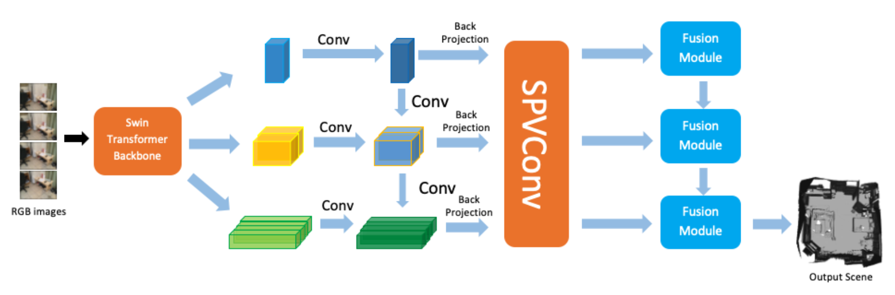

# End-to-end Learned Multi-View Stereo Reconstruction with Transformers

 <p align = "justify"> In this project, we propose a deep learning framework for end-to-end multi-view stereo reconstruction integrated with transformer module to further improve the performance of current methods. From an input monocular RGB video and camera
parameters, we reconstruct the surface geometry directly
by regressing a sparse TSDF volume. A Swin-Transformer
backbone is used to extract the most informative features
for downstream fusion tasks. Features of keyframes are
back-projected to 3D space, constructing a local window
for representing the local geometry. TSDF values are regressed using sparse convolution in a coarse-to-fine manner to ignore free space and increase computational efficiency. A transformer-based fusion module makes the local
reconstruction to be globally consistent with the previously
reconstructed windows. Our method is able to learn the local smoothness and global shape prior of 3D surfaces at
interactive rates. Experiments on ScanNet show that the reconstruction quality and efficiency of our method are comparable to current state-of-the-art methods.

Check the report, slides and other materials in the folder `docu`.




Authors: Dongyue Lu and Zhisheng Zheng, supervised by Prof. Dr. Matthias Nießner.


## Run the code
### 1. Installation
This code is tested under Python 3.7.9, PyTorch 1.6.0 on Ubuntu 18.04.
Simply run the following commands.

```
conda env create -f environment.yaml
conda activate mvs
```


### 2. Data Preparation
We use [ScanNet](http://www.scan-net.org/) dataset, please follow the instructions  and download and extract it.

Then run the data preparation script which parses the raw data into the processed pickle format. It also generates the ground truth TSDFs using TSDF Fusion. Here you can also set the desired TSDF voxel size and training window size.

```
python tools/generate_gt.py --data_path DATASET_PATH --save_path GT_PATH
```
### 3. Train
Start training by running the following command. Set the `mode` to train or test when training or inference, respectively. Intermediate results are stored in `OUTPUT_PATH`. We choose 10000 windows for training, it takes about a day to train with Nvidia RTX 2080 GPU.

```
python main.py --data_path DATASET_PATH --save_path OUTPUT_PATH --mode MODE
```

### 4. Evaluation

We use precision, recall and F-score to evaluate the reconstruction errors between ground truth mesh and predicted mesh. Input the intermediate results last step and ground truth, and you can get the evaluation results.

```
python tools/metrics.py --pred_path OUTPUT_PATH --gt_path GT_PATH
```